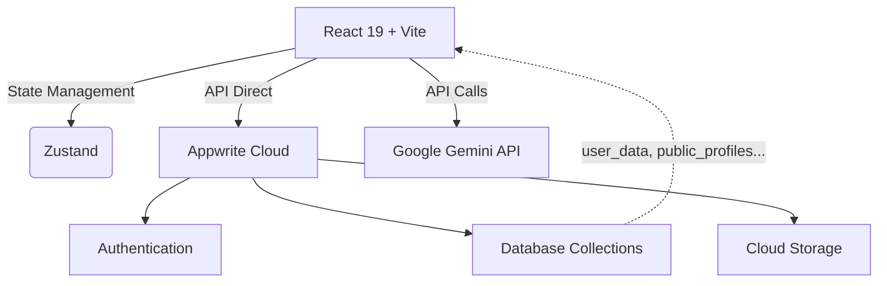

<div align="center">
  

  <h1>💍 WedPlan AI</h1>
  
  <p><strong>Nền tảng lập kế hoạch cưới hỏi thông minh tích hợp trí tuệ nhân tạo (AI)</strong></p>

  <p>
    <a href="https://react.dev/"></a>
    <a href="https://vite.dev/"></a>
    <a href="https://tailwindcss.com/"></a>
    <a href="https://appwrite.io/"></a>
    <a href="https://aistudio.google.com/"></a>
    <a href="https://vercel.com/"></a>
  </p>
</div>

<br />

## 🌟 Giới Thiệu

**WedPlan AI** là một ứng dụng đột phá giúp các cặp đôi lên kế hoạch cho ngày cưới trở nên hoàn hảo, dễ dàng và cá nhân hóa. Được trang bị các công nghệ mới nhất và trợ lý ảo thông minh **Google Gemini 2.5**, ứng dụng không chỉ đóng vai trò là một người nhắc việc mà còn như một chuyên gia tư vấn tổ chức, am hiểu quy trình, dự trù ngân sách và thậm chí là tính toán phong thủy.

Thuật toán lưu trữ mạnh mẽ qua **Appwrite** mang đến giải pháp bảo mật với quyền riêng tư cao nhất cho mỗi dữ liệu cá nhân, từ lập danh sách khách mời đến tạo những tấm thiệp mời trực tuyến ấn tượng.

---

## ✨ Tính Năng Nổi Bật

### 🤖 Trợ Lý Ai Thông Minh (Gemini Powered)
- **Tư vấn cưới hỏi:** Hỏi đáp mọi vấn đề từ nghi lễ, mâm quả, đến việc chọn váy cưới.
- **Tạo nội dung thiệp:** Viết lời mời sáng tạo, ngọt ngào và độc đáo.
- **Phong thủy cưới hỏi:** Xem ngày tốt xấu, đánh giá tuổi hợp/xung dựa trên cơ sở triết học cổ truyền Phương Đông.

### 👥 Quản Lý Khách Mời & Ngân Sách
- Xây dựng danh sách khách mời tự động thông minh.
- Lên bảng ngân sách dự trù chi tiết, tránh tối đa phát sinh.
- Biểu đồ thống kê trực quan với **Recharts**.

### ✉️ Thiệp Mời Số & QR Code
- Thiết kế và tùy chỉnh thiệp điện tử của riêng bạn.
- Tạo đường dẫn chia sẻ public không cần đăng nhập cho khách mời.
- Tích hợp QR code giúp việc gửi thư và chia sẻ thuận tiện hơn bao giờ hết.

### ☁️ Đồng Bộ Hóa Đám Mây Mọi Lúc Mọi Nơi
- Lưu trữ an toàn trên hạ tầng **Appwrite Cloud**.
- Tự động lưu mọi thay đổi với debounce chống quá tải.
- Sử dụng Guest Mode giới hạn bằng IP nếu người dùng chưa kịp tạo tài khoản.

---

## 🛠 Tech Stack

- **Frontend:** React 19, Vite 6, TypeScript 5.8
- **Styling UI:** Tailwind CSS 4, Radix UI & Lucide Icons
- **Quản lý dữ liệu:** Zustand (Local state)
- **Backend & BaaS:** Appwrite (Auth, Database, Storage)
- **AI Engine:** Google Gemini (Generative AI)
- **Hosting:** Vercel (SPA routing support)

---

## 🚀 Hướng Dẫn Cài Đặt (Quick Start)

Tham khảo chi tiết toàn bộ cách cấu hình Environment, Database và Authentication tại: 👉 [**SETUP.md**](./SETUP.md).

### 1. Cài đặt các thư viện phụ thuộc
```bash
npm install
```

### 2. Cấu hình biến môi trường
Tạo file `.env.local` tại thư mục gốc của dự án:
```env
VITE_APPWRITE_ENDPOINT=https://sgp.cloud.appwrite.io/v1
VITE_APPWRITE_PROJECT_ID=your-project-id
VITE_APPWRITE_DATABASE_ID=your-database-id
VITE_APPWRITE_BUCKET_ID=your-bucket-id
VITE_GEMINI_API_KEY=your-gemini-api-key
```

### 3. Chạy môi trường phát triển (Development)
```bash
npm run dev
# Server sẽ chạy tại http://localhost:3000
```

---

## 🏛 Kiến Trúc Tổng Quan



---

## 🤝 Đóng Góp (Contributing)

Chúng tôi hoan nghênh mọi đóng góp để đưa hệ thống tiến xa hơn:
1. Fork repository này.
2. Tạo một nhánh mới với tính năng bạn muốn thêm (`git checkout -b feature/NewFeature`).
3. Commit các thay đổi (`git commit -m 'Add some NewFeature'`).
4. Push nhánh của bạn (`git push origin feature/NewFeature`).
5. Tạo một Pull Request (PR) để được xem xét.

---

<div align="center">
  <b>Được thiết kế với ❤️ để mang lại hạnh phúc cho ngày trọng đại nhất.</b>
</div>
